# 🚀 Guide de déploiement automatique ATMR

**Date** : 2026-01-08  
**Statut** : ✅ CI/CD activé et opérationnel

---

## 🎯 VUE D'ENSEMBLE

Ce projet utilise **GitHub Actions** pour automatiser le build et le déploiement :

1. **Sur chaque push vers `main`** → Build automatique de l'image Docker → Push vers Docker Hub → Déploiement sur le serveur
2. **Déclenchement manuel** disponible aussi (via GitHub Actions UI)

---

## ⚡ QUICK START

### 1. Configurer les secrets GitHub (une seule fois)

**📖 Guide complet** : `backend/GITHUB_SECRETS_GUIDE.md`

**Secrets minimaux requis** :

```
GitHub → Settings → Secrets and variables → Actions → New repository secret
```

| Secret              | Description                      |
| ------------------- | -------------------------------- |
| `DOCKER_IMAGE`      | `djasiqi/atmr-backend`           |
| `DOCKER_TAG`        | `latest`                         |
| `DOCKERHUB_USERNAME`| Votre username Docker Hub        |
| `DOCKERHUB_TOKEN`   | Token Docker Hub                 |
| `SSH_HOST`          | IP du serveur (ex: `138.201.155.201`) |
| `SSH_USER`          | User SSH (ex: `deploy`)          |
| `SSH_PORT`          | Port SSH (ex: `22`)              |
| `SSH_KEY`           | Clé privée SSH (copier `~/.ssh/id_rsa`) |
| `POSTGRES_USER`     | `atmr_user`                      |
| `POSTGRES_PASSWORD` | Mot de passe PostgreSQL          |
| `POSTGRES_DB`       | `atmr_db`                        |
| `REDIS_PASSWORD`    | Mot de passe Redis               |
| `SECRET_KEY`        | Clé secrète Flask                |
| `JWT_SECRET_KEY`    | Clé JWT                          |
| `APP_ENCRYPTION_KEY_B64` | Clé Fernet (encryption)     |
| `MASTER_ENCRYPTION_KEY` | Clé AES-256 (IBAN)           |
| `SOCKETIO_CORS_ORIGINS` | `https://www.lirie.ch,https://lirie.ch` |

**🔧 Génération des clés** : Voir `backend/GITHUB_SECRETS_GUIDE.md`

---

### 2. Déclencher un déploiement

#### Option A : Automatique (push vers main)

```bash
# Faire un commit et push
git add .
git commit -m "feat: New feature"
git push origin main

# ✅ Le workflow se lance automatiquement
# Aller sur GitHub → Actions pour suivre le déploiement
```

#### Option B : Manuel (via GitHub UI)

```
1. Aller sur GitHub → Actions
2. Cliquer sur "Build & Deploy"
3. Cliquer sur "Run workflow"
4. (Optionnel) Spécifier un tag personnalisé
5. Cliquer sur "Run workflow" (vert)
```

---

### 3. Suivre le déploiement

```
GitHub → Actions → Build & Deploy → [Dernier run]

Le workflow se déroule en 2 étapes :
1. 🔨 Build & Push (5-10 min)
   - Build de l'image Docker
   - Scan de sécurité Trivy
   - Push vers Docker Hub

2. 🚀 Deploy (3-5 min)
   - Pull de la nouvelle image
   - Redémarrage des services
   - Migrations Alembic
   - Smoke tests
```

---

## 📊 ÉTAT DU WORKFLOW

### Dernière modification

- **Date** : 2026-01-08
- **Commit** : `a987f774` (Fix PostgreSQL healthcheck)
- **Statut** : ✅ Workflow réactivé

### Fichiers modifiés

- ✅ `.github/workflows/deploy.yml` - Workflow réactivé (push main)
- ✅ `docker-compose.production.yml` - Fix PostgreSQL healthcheck
- ✅ `backend/GITHUB_SECRETS_GUIDE.md` - Documentation secrets
- ✅ `backend/DEPLOY_FIX_PROCEDURE_COMPLETE.md` - Procédure de correction
- ✅ `backend/DEPLOY_ERRORS_TODO.md` - Analyse des erreurs

---

## 🔍 VÉRIFIER QUE ÇA FONCTIONNE

### 1. Vérifier que l'image est sur Docker Hub

```bash
# Vérifier que l'image existe
docker manifest inspect djasiqi/atmr-backend:latest
```

### 2. Vérifier que le backend est UP

```bash
# Tester l'API
curl -I https://www.lirie.ch/health
# Attendre: HTTP/2 200

curl -I https://api.lirie.ch/health
# Attendre: HTTP/2 200
```

### 3. Vérifier les logs

```bash
# SSH au serveur
ssh deploy@138.201.155.201

# Voir les logs backend
cd /srv/atmr
docker compose -f docker-compose.production.yml logs -f backend

# Attendre le message : "✅ Backend démarré"
```

---

## 🛟 DÉPANNAGE

### Workflow échoue : "Secrets manquants"

**Erreur** :

```
❌ Secrets manquants: DOCKER_IMAGE, DOCKERHUB_TOKEN
```

**Solution** :

```
1. Aller sur GitHub → Settings → Secrets and variables → Actions
2. Ajouter les secrets manquants (voir GITHUB_SECRETS_GUIDE.md)
3. Relancer le workflow
```

---

### Workflow échoue : "Image not found on Docker Hub"

**Erreur** :

```
❌ L'image djasiqi/atmr-backend:latest n'a pas été trouvée sur Docker Hub
```

**Cause** : Credentials Docker Hub invalides

**Solution** :

```
1. Régénérer un token Docker Hub : https://hub.docker.com/settings/security
2. Mettre à jour DOCKERHUB_TOKEN dans GitHub Secrets
3. Relancer le workflow
```

---

### Backend ne démarre pas : "ModuleNotFoundError: flask_limiter.storage"

**Cause** : Image Docker Hub obsolète (pas de `Flask-Limiter[redis]`)

**Solution** :

```
✅ DÉJÀ CORRIGÉ dans ce commit !

Le workflow GitHub Actions va rebuilder automatiquement l'image
avec Flask-Limiter[redis] au prochain push.

Si vous voulez forcer le rebuild maintenant :
1. Aller sur GitHub → Actions → Build & Deploy
2. Cliquer sur "Run workflow"
3. Attendre 10-15 minutes
```

---

### Migrations Alembic échouent

**Erreur** :

```
❌ Error: No such command 'db'.
```

**Cause** : Backend ne peut pas importer l'app (dépendance manquante)

**Solution** : Corriger le problème d'import d'abord (voir erreur précédente)

---

## 📖 DOCUMENTATION COMPLÈTE

| Fichier                                       | Description                                   |
| --------------------------------------------- | --------------------------------------------- |
| `backend/GITHUB_SECRETS_GUIDE.md`             | Guide complet des secrets GitHub              |
| `backend/DEPLOY_FIX_PROCEDURE_COMPLETE.md`    | Procédure de correction du déploiement        |
| `backend/DEPLOY_ERRORS_TODO.md`               | Analyse des erreurs de déploiement            |
| `.github/workflows/deploy.yml`                | Workflow GitHub Actions                       |

---

## 🔐 SÉCURITÉ

### ✅ Bonnes pratiques

- **Secrets** : Tous les secrets sont stockés dans GitHub Secrets (chiffrés)
- **SSH** : Clé privée chiffrée, jamais exposée dans les logs
- **Docker Hub** : Token avec permissions limitées (Read, Write, Delete uniquement)
- **Scan de sécurité** : Trivy scan automatique de l'image Docker
- **SBOM** : Software Bill of Materials généré automatiquement

### ⚠️ Important

- **Ne jamais** commit les secrets dans Git
- **Ne jamais** logger les secrets (même pour debug)
- **Renouveler** les secrets tous les 6-12 mois
- **Limiter** l'accès aux secrets GitHub (Settings → Collaborators)

---

## 🎓 COMMENT ÇA MARCHE

### Workflow complet

```mermaid
graph LR
    A[Push vers main] --> B[GitHub Actions]
    B --> C[Build Dockerfile.production]
    C --> D[Scan Trivy]
    D --> E[Push Docker Hub]
    E --> F[SSH au serveur]
    F --> G[Pull nouvelle image]
    G --> H[Down + Up services]
    H --> I[Migrations Alembic]
    I --> J[Smoke tests]
    J --> K[✅ Déploiement réussi]
```



### Fichiers clés

```
.github/workflows/deploy.yml
    ↓
backend/Dockerfile.production
    ↓
Docker Hub: djasiqi/atmr-backend:latest
    ↓
Serveur: /srv/atmr/docker-compose.production.yml
    ↓
Backend: http://localhost:5000 (Traefik → https://www.lirie.ch)
```

---

## 📝 CHANGELOG

### 2026-01-08 - Réactivation du workflow

- ✅ Workflow GitHub Actions réactivé (push main)
- ✅ Fix PostgreSQL healthcheck (`pg_isready -U ${POSTGRES_USER}`)
- ✅ Documentation complète des secrets
- ✅ Guide de déploiement créé

### Problème résolu

**Avant** :
- ❌ Workflow suspendu (déclenchement manuel seulement)
- ❌ Image Docker Hub obsolète (pas de `Flask-Limiter[redis]`)
- ❌ Backend ne démarre pas : `ModuleNotFoundError: flask_limiter.storage`

**Après** :
- ✅ Workflow automatique sur push main
- ✅ Image Docker Hub sera à jour automatiquement
- ✅ Backend démarre correctement

---

## 🚀 PROCHAINES ÉTAPES

### Court terme (aujourd'hui)

1. ✅ Configurer les secrets GitHub (voir `GITHUB_SECRETS_GUIDE.md`)
2. ✅ Déclencher un build manuel (GitHub Actions → Run workflow)
3. ✅ Vérifier que l'image est sur Docker Hub
4. ✅ Vérifier que le backend démarre

### Moyen terme (cette semaine)

1. ⏳ Ajouter tests d'intégration au workflow
2. ⏳ Configurer les notifications de déploiement (email / monitoring)
3. ⏳ Configurer rollback automatique en cas d'échec
4. ⏳ Documenter la procédure de rollback manuel

### Long terme (ce mois)

1. ⏳ Ajouter environnement staging (pré-production)
2. ⏳ Configurer blue-green deployment
3. ⏳ Ajouter canary deployment (déploiement progressif)
4. ⏳ Configurer auto-scaling (si nécessaire)

---

**Créé le** : 2026-01-08  
**Auteur** : Configuration automatique CI/CD  
**Statut** : ✅ Prêt pour utilisation  
**Contact** : Voir `backend/GITHUB_SECRETS_GUIDE.md` pour support
