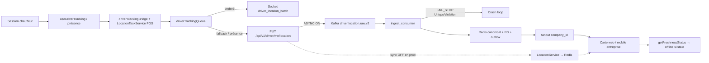

# Audit prod — chauffeurs offline / GPS live (2026-07-31)

Diagnostic **lecture seule** (SSH + ADB + dépôt). Aucun secret exposé.

## 1. Verdict exécutif

**Les chauffeurs sont offline parce que Redis live (vérité Model A `driver:{id}:loc:canonical`) est vide**, alors que le frontend/mobile entreprise calcule online/offline depuis cette source (puis fallback PG stale).

**Panne principale : plusieurs couches simultanées**, avec rupture primaire côté **pipeline Kafka ingest** :

1. `TRACKING_INGEST_ASYNC_ENABLED=true` → le PUT GPS répond `202 queued_kafka` **sans** écrire Redis.
2. `atmr-tracking-kafka-consumer-1` est en **crash-loop** (`RestartCount≈159`) sur `UniqueViolation uq_tracking_ingest_session_sequence` (poison message, ex. driver `7514`, `sequence_id=1`).
3. En parallèle, l’ingest HTTP est saturé : **~25 583 × 429** et **~3 001 × 401** sur 60 min (quasi aucun succès durable).

Conséquence : pas de mise à jour Redis → pas de fanout live utile → cartes web/mobile affichent **offline** même si mission métier active.

## 2. Preuves

| Étape | Résultat observé | Preuve | Verdict |
| --- | --- | --- | --- |
| GPS téléphone | Fixes GNSS ; fused filtre too close/fast | `adb logcat` S23 | PARTIEL |
| Tracking runtime | FGS `LocationTaskService` up ; `Location unavailable…` répété | `dumpsys` + logcat PID app | KO delivery |
| Requête mobile | Storm 429/401 ; 39×202 / 60m | access log `atmr-backend-1` | KO |
| Backend ingest sync | Court-circuité par async Kafka | `routes/driver.py` + env | désactivé |
| Kafka producer | Topic `driver.location.raw.v2` peuplé | consumer-groups describe | OK partiel |
| Kafka consumer | Fail-stop UniqueViolation ; restarts | logs consumer | KO |
| Redis live | **0** clé canonical/legacy/raw/geo | `scan_iter` via backend | KO |
| PostgreSQL | 0 update 30m ; plus récent ~7.5h | `Driver.last_position_update` | stale |
| WebSocket | Pas de batch utile ; group processed absent | ws logs + groups | KO/idle |
| Frontend web | `GET …/drivers/live` 200 ~16KB | access log dashboard company | symptôme |
| Mobile entreprise | Même contrat REST/WS Model A | code unified-app | symptôme |

## 3. Pipeline réellement implémenté



**Prod déployée**

- Source rev : `0f5b127c` (sync 2026-07-28)
- Images : backend/ws `sha-ec06ce42aace` ; **kafka-consumer + outbox = `djasiqi/atmr-backend:v5`** (drift)
- Flags : `KAFKA_ENABLED=true`, `TRACKING_INGEST_ASYNC_ENABLED=true`, topics `*.v2`

## 4. Chronologie (UTC) — rupture

```text
~2026-07-30 23:30  ingest events driver 7514 seq 1–2 déjà en PG
~2026-07-31 06:29  rejeu Kafka même session/seq=1, autre location_event_id
06:29+            UniqueViolation → FatalTrackingConsumerError db_fail_stop
06:49–07:00       RestartCount consumer → ~159 ; partitions réassignées en boucle
06:00–07:00       PUT location : majoritairement 429/401 ; Redis canonical reste 0
ongoing           GET /companies/me/drivers/live 200 mais location_status offline
```

**Premier point de rupture durable : consumer Kafka (persist outbox) + absence de filet sync Redis.**

## 5. Causes racines

### P0 — Consumer fail-stop sur contrainte session/sequence

- Fichiers : `backend/services/tracking/persist_with_outbox.py`, `db_error_classification.py`, `ingest_consumer.py`
- Comportement : `ON CONFLICT (driver_id, location_event_id)` seulement ; doublon `(driver_id, tracking_session_id, sequence_id)` → `IntegrityError` → **FAIL_STOP** (pas DLQ) → offset non commit → poison permanent
- Preuve prod : logs consumer + rows PG session `trk_sess_1785454202260_q98hodqy` seq 1 déjà présents

### P0 — Async Kafka sans filet live

- Fichier : `backend/routes/driver.py` (~1805–1876)
- Comportement : `accepted_async` / HTTP 202 **avant** Redis/WS
- Preuve : Redis 0 clé ; PG 0 update 30m

### P0 — Storm 429

- Fichier : `backend/services/geolocation/driver_location_http.py`
- Comportement : limite 60/min ; **`zadd` même sur rejet** → saturation auto-entretenue avec retries clients (iOS CFNetwork + Android okhttp)
- Preuve : 25583×429 / 60m

### P1 — Android FGS sans delivery (appareil test)

- Package `ch.liri.operations` ; permissions FINE/COARSE/BACKGROUND OK ; FGS running
- `LocationTaskConsumer`: `Location unavailable for foreground-service task delivery` en boucle
- Aggrave le cas local ; **n’explique pas l’offline global**

### P1 — Drift d’images + 401 massifs

- Consumer `:v5` ≠ backend `sha-ec06…`
- 3001×401 tracking (sessions/tokens)

## 6. Correctifs proposés (PR ordonnées)

| PR | Objectif | Changements | GO/NO-GO |
| --- | --- | --- | --- |
| PR1 | Dépoisonner consumer | Idempotence `uq_tracking_ingest_session_sequence` (skip+commit) ; duplicate IntegrityError ≠ fail-stop ; aligner image consumer sur SHA backend | Consumer stable 30m, lag≈0 |
| PR2 | Filet live | Si consumer unhealthy/lag>N → fallback sync `LocationService` ; alerte | Redis canonical age≤120s pour chauffeurs actifs |
| PR3 | Rate-limit | Pas de `zadd` sur 429 ; backoff client ; métriques | 429 ≪ 202/200 |
| PR4 | Android availability | Fallback last-known / high accuracy si availability=false | Plus de silence FGS > seuil |

**Rollback** : feature flag sync fallback ; rollback image consumer ; rate-limit config via env.

## 7. Tests à ajouter (minimum)

- UniqueViolation session/sequence → skip/DLQ, offset avance
- Async ACK puis consumer down → fallback sync Redis
- Rate-limit : rejet n’incrémente pas le compteur
- Course login/logout/startTracking/stopTracking
- Sequence GPS monotone + idempotence event id
- E2E : Android → Kafka → Redis → WS → carte (seuil freshness)

## 8. Observabilité

Métriques proposées : `gps_ingest_accepted_total{transport,status}`, `gps_kafka_consumer_fail_stop_total`, `gps_redis_canonical_fresh_drivers`, `gps_http_429_total`, `gps_tracking_runtime_active`, `gps_last_point_age_seconds`.

Corrélation : `trace_id`, `driver_id`, `company_id`, `mission_id`, `sequence`, timestamps client/serveur — **jamais** token ni GPS en clair dans logs généraux.

## 9. Réponses factuelles aux 17 questions

1. Tracking démarre ? **Oui** (task + FGS enregistrés) sur S23.
2. Coords GPS ? **Oui au niveau OS** ; delivery app souvent bloquée (availability).
3. Permissions ? **OK** (dont background).
4. BG / écran verrouillé ? FGS up ; delivery JS douteuse.
5. Contexte mission ? Runtime présent ; pas vérifié bout-en-bout faute d’envois acceptés.
6. Requêtes quittent le téléphone ? **Oui** (okhttp visibles) mais **rejetées** en masse.
7. Token ? **Souvent invalide** (401) ou rate-limité (429) — valeur non exposée.
8. Backend reçoit ? **Oui** (access log).
9. Accepte ? **Rarement** (39×202 vs 25k×429).
10. Kafka ? **Oui** pour une fraction ; backlog/poison.
11. Consommées/persistées ? **Non durablement** (crash-loop).
12. Redis live ? **Vide**.
13. PG ? **Anciennes** positions seulement.
14. WS publish live ? **Pas observé** de façon utile.
15. Abonnements carte ? Contrat OK ; **source vide**.
16. Online/offline ? **Bonne source (Redis)** + seuils ; source morte → offline correct.
17. Global vs local ? **Global** (Redis/Kafka/429) + frein local Android sur S23.
