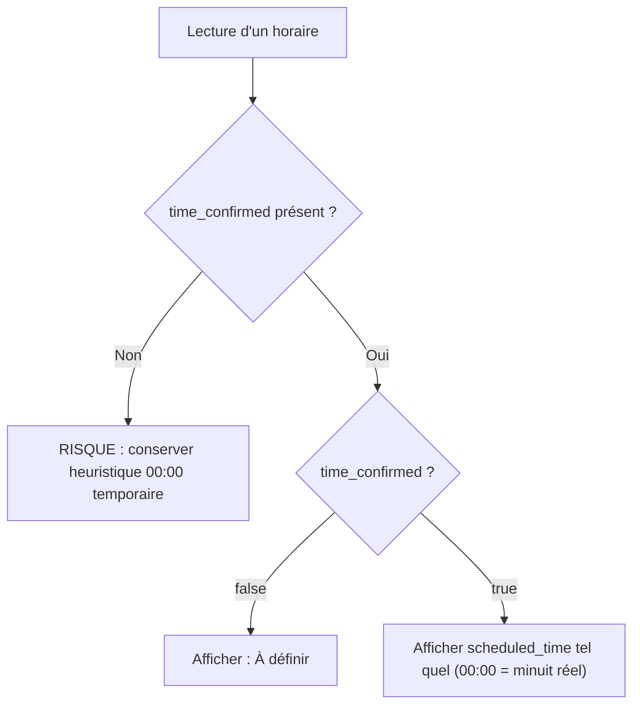

# Backlog Phase 2 — Migration des lectures `00:00` → `time_confirmed`

```txt
Status: COMPLETED (2026-06-22) — helpers hasScheduledPickupTime / hasConfirmedPickupTime + stop-gate CI
Date: 2026-06-22
Owner: équipe ATMR
Contrat: docs/architecture/canonical-display-model.md
Stop gates: scripts/check_no_sentinel_heuristics.py (repo-integrity CI) · E2E urgent 6/6 ✅
Phase 4 (migration SQL 00:00 → NULL): 🔒 BLOCKED tant que validation staging manuelle
```

> ✅ **Implémenté (2026-06-22) :** module centralisé `backend/services/companies/booking_display.py`
> (`is_legacy_midnight_pickup_sentinel`, `booking_has_scheduled_pickup_time`, `booking_has_confirmed_pickup_time`,
> `scheduling.time_scheduled`), helpers mobile `pickupSentinel.ts` / chauffeur `pickupScheduling.ts`,
> web `bookingScheduling.js`, migration transporteur (ReservationActions, FullyAutoPanel, SemiAutoPanel,
> ReservationModals, EditReservationModal, ReservationDetailPanel), POST `/v1/rides/{id}/urgent` Modèle A.

---

## Règle métier validée — deux helpers

| Helper | Question | Utilisé pour |
|--------|----------|--------------|
| `hasScheduledPickupTime` | Une heure métier est-elle renseignée ? | Urgent, « À définir », tri sans heure |
| `hasConfirmedPickupTime` | Heure confirmée workflow (INV-2) ? | Retards, assignation, dispatch |

**Urgent (Modèle A)** : autorisé uniquement si `!hasScheduledPickupTime` (null ou legacy 00:00).
Une heure renseignée non confirmée (ex. retour 13:30) **bloque** l'urgence.

---

## Ancien statut (2026-06-12)

```txt
Status: IN PROGRESS — Canonical Display Model v1 déployé (BK-01 / TR-01 auto PASS)
```

---

## 1. Contexte et objectif

**Phase 1 (écritures) ✅ COMPLETED** : plus aucune nouvelle donnée métier « heure à définir » n'est
écrite sous forme de `00:00`. Les nouvelles données utilisent `scheduled_time = NULL` +
`time_confirmed = false`.

**Phase 2 (lectures) 🟡 READY TO START** : remplacer les heuristiques `hour === 0` / `T00:00:00`
par `time_confirmed` comme **unique source de vérité** côté affichage, tri, notifications et exports.

Pendant Phase 2 (avant Phase 4), deux représentations legacy coexistent en base :

| Représentation | `scheduled_time` | `time_confirmed` | Lecture cible |
|----------------|------------------|------------------|---------------|
| Nouveau modèle | `null` | `false` | « À définir » |
| Legacy | `00:00` | `false` | « À définir » |
| Heure confirmée | `14:30` | `true` | `14:30` |
| Minuit réel | `00:00` | `true` | `00:00` |

La règle `time_confirmed === false → « À définir »` couvre **les deux** cas « à définir » sans
heuristique horaire.

---

## 2. Règle de lecture cible



| État | `scheduled_time` | `time_confirmed` | Affichage |
|------|------------------|------------------|-----------|
| Heure confirmée | `2026-06-11T14:30:00` | `true` | `14:30` |
| Heure à définir (nouveau) | `null` | `false` | « À définir » |
| Heure à définir (legacy) | `2026-06-11T00:00:00` | `false` | « À définir » |
| Minuit réel confirmé | `2026-06-11T00:00:00` | `true` | `00:00` |

---

## 3. Déjà migré (Phase 1 — hors périmètre Phase 2)

Ces surfaces institution utilisent déjà `time_confirmed` sans heuristique `00:00` :

| Fichier | Notes |
|---------|-------|
| `frontend/src/utils/formatLegTime.js` | Helpers `formatLegTime`, `formatReturnTimeLabel` |
| `frontend/src/pages/institution/Requests/InstitutionRequests.jsx` | Liste des demandes |
| `frontend/src/pages/institution/Requests/RequestDetailPanel.jsx` | Détail multi-stop / retour |
| `frontend/src/pages/institution/Requests/InstitutionOperationalEdit.jsx` | Validation passé via `time_confirmed` |
| `backend/models/transport_request_leg.py` | `time_confirmed` calculé à la sérialisation |

---

## 4. Inventaire des sites de lecture (sous-lots)

### Lot 2A — Frontend web transporteur

| Priorité | Fichier | Lignes | Pattern actuel | Action Phase 2 |
|----------|---------|--------|----------------|----------------|
| P0 | `frontend/src/utils/formatDate.js` | 65–87, 89–102 | Branche `time_confirmed` **+** bloc `hours === 0 && minutes === 0` | Supprimer L89–102 ; conserver L65–87 ; généraliser `time_confirmed !== true → « À définir »` pour tous les bookings (pas seulement retours) |
| P0 | `frontend/src/components/reservations/ReservationActions.jsx` | 56–77, 82 | Regex `T00:00` + `getHours()===0` **+** `time_confirmed` | Retirer regex et `getHours()` ; ne garder que `time_confirmed` / `scheduled_time` absent |
| P0 | `frontend/src/pages/company/Dashboard/components/DispatchTable.jsx` | 53–71 | Idem `checkNeedsTimeConfirmation` | Idem |
| P1 | `frontend/src/pages/company/Dispatch/components/FullyAutoPanel.jsx` | 51–61, 65–70 | `formatTime` et `isReturnToSchedule` via `getHours()===0` | Basculer sur `time_confirmed` ; L533 consomme `formatTime` |
| P1 | `frontend/src/pages/company/Dispatch/components/SemiAutoPanel.jsx` | 51–55 | Tri « heures à définir » via `getHours()===0` | Tri sur `time_confirmed === false \|\| scheduled_time == null` |
| P1 | `frontend/src/pages/company/Reservations/components/ReservationDetailPanel.jsx` | 212–213 | `form.scheduled_time === "00:00"` pour validation passé | Utiliser `reservation.time_confirmed === false` (aligné `InstitutionOperationalEdit.jsx`) |
| P2 | `frontend/src/components/reservations/ReservationModals.jsx` | 85–88, 127 | Pré-remplissage modal retour + `formatAllerTime` via `getHours()===0` | Lire `time_confirmed` du booking retour ; vider l'heure si non confirmée |
| — | Consommateurs de `renderBookingDateTime` | — | Délèguent à `formatDate.js` | Corrigés automatiquement quand 2A-P0 est fait |

**Consommateurs transitifs de `renderBookingDateTime` (pas de patch direct nécessaire) :**

- `frontend/src/pages/company/Dashboard/components/ReservationTable.jsx`
- `frontend/src/components/virtualized/VirtualizedDispatchTable.jsx`
- `frontend/src/components/virtualized/VirtualizedReservationTable.jsx`
- `frontend/src/components/virtualized/DispatchTableRow.jsx`
- `frontend/src/pages/company/components/DispatchTable.jsx`
- `frontend/src/components/widgets/CourseDetailsModal.jsx`
- `frontend/src/pages/company/Dashboard/components/ReservationDetailsModal.jsx`
- `frontend/src/pages/company/Clients/components/ClientReadView.jsx`

**Déjà partiellement aligné (vérifier après 2A-P0) :**

- `frontend/src/pages/company/Dashboard/components/ReservationTable.jsx` L197 : `_needsTimeConfirmation` utilise déjà `time_confirmed === false`.

---

### Lot 2B — Mobile (entreprise + chauffeur)

| Priorité | Fichier | Lignes | Pattern actuel | Action Phase 2 |
|----------|---------|--------|----------------|----------------|
| P0 | `mobile/unified-app/src/features/company/utils/pickupSentinel.ts` | 4–10 | `isPickupSentinel` : regex `T00:00:00` + null | Nouvelle fonction `isTimeUndefined({ scheduled_at, time_confirmed })` ; conserver `isPickupSentinel` en fallback legacy si flag absent |
| P0 | `mobile/unified-app/src/features/company/dashboard/companyDashboardMissionUi.ts` | 40–42, 68–71 | `formatMissionScheduleTimeLabel` / `missionHasDefinedPickupTime` via `isPickupSentinel` | Basculer sur `time_confirmed` quand présent dans le payload mission |
| P0 | `mobile/unified-app/app/(app)/(driver)/trips.tsx` | 128–133, 1149, 1165, 1606, 1627, 2135, 2160, 2893, 2918, 3649, 3670–3671 | 6 helpers dupliqués `getHours()===0` + labels « Heure à définir » | Factoriser un helper unique basé sur `time_confirmed` ; supprimer heuristiques horaires |
| P1 | `mobile/unified-app/src/features/company/components/DispatchRideListCard.tsx` | 253 | `hasSchedule` via `isPickupSentinel` | Idem helper unifié |
| P1 | `mobile/unified-app/src/features/company/components/rides/CompanyRidesMissionFlatList.tsx` | 103 | `showUrgent` via `isPickupSentinel` | Idem |
| P1 | `mobile/unified-app/app/(app)/(company)/rides.tsx` | 615, 649–650 | Filtres retard / urgent via `isPickupSentinel` | Idem |
| P1 | `mobile/unified-app/src/features/company/components/maps/DriverBottomSheet.tsx` | 343, 877 | Tri + affichage via `isPickupSentinel` | Idem |
| P1 | `mobile/unified-app/src/features/company/dashboard/useCompanyDashboardScreenModel.ts` | 307–309 | Compteur retard via `missionHasDefinedPickupTime` | Idem (transitif via `companyDashboardMissionUi.ts`) |
| P2 | `mobile/unified-app/src/features/company/api/companyApi.ts` | 380–384 | Mappe `scheduled_at` depuis `pickup_at` uniquement, **sans** `time_confirmed` | Mapper `time_confirmed` depuis l'API une fois exposé (prérequis serializer) |

---

### Lot 2C — Backend notifications

| Priorité | Fichier | Lignes | Pattern actuel | Action Phase 2 |
|----------|---------|--------|----------------|----------------|
| P1 | `backend/services/notifications/push_message_builder.py` | 153–177 (`_get_time_short`) | Extrait `HH:MM` depuis `scheduled_time` sans regarder `time_confirmed` | Si `not time_confirmed` → libellé « À définir » ; si `time_confirmed` + 00:00 → « 00:00 » |
| P2 | `backend/shared/time_utils.py` | 276–287 (`is_return_time_pending`) | `hour==0 && minute==0` = pending | Migrer vers `time_confirmed` ; conserver en legacy/tests jusqu'à Phase 4 |
| — | `backend/routes/company_mobile_dispatch.py` | 563–574, 2002–2008 | Sérialisation `pickup_at` : preserve sentinelle 00:00 naïve pour `isPickupSentinel` | **Prérequis** : exposer `time_confirmed` dans le payload ride **avant** de retirer la logique sentinelle côté client |

---

### Lot 2D — Exports

| Priorité | Fichier | Lignes | Pattern actuel | Action Phase 2 |
|----------|---------|--------|----------------|----------------|
| P2 | `backend/services/institutions/export_transports.py` | 147–150, 165–166 | `_fmt_dt(scheduled, "%H:%M")` direct sur `TransportRequest.scheduled_time` | Si booking lié : utiliser `booking.time_confirmed` ; si TR retour : `return_time_confirmed` ; afficher « À définir » si non confirmé |
| P2 | Exports company (PDF/CSV) | À auditer | Probable formatage direct de `scheduled_time` | Grep ciblé sur `routes/bookings.py`, exports admin ; même règle |

---

## 5. Prérequis bloquant : présence de `time_confirmed` dans les payloads de lecture

**Risque n°1 Phase 2** : retirer l'heuristique `00:00` sans flag fiable dans le payload casse
l'affichage mobile ou transporteur.

### Règle de sécurité (bloquante)

```txt
Si un payload ne contient pas time_confirmed,
Phase 2 ne doit PAS supprimer l'heuristique 00:00 sur cette surface.
```

La suppression de l'heuristique sur une surface (vue web, écran mobile, notification, export) est
**conditionnée** à la présence vérifiée de `time_confirmed` dans le payload qui l'alimente. Toute
surface dont l'API ne renvoie pas encore le flag conserve l'heuristique legacy jusqu'à correction
du serializer (sous-ticket « exposer time_confirmed » préalable).

### Audit serializers / APIs (2026-06-12)

| Source | `time_confirmed` exposé ? | Consommateurs | Statut Phase 2 |
|--------|---------------------------|---------------|----------------|
| `Booking.serialize()` — `backend/models/booking.py` L624 | **Oui** | Web transporteur, détail réservation | ✅ Prêt pour 2A |
| `Booking.serialize_dashboard()` — L767 | **Oui** | Dashboard company (`routes/companies.py` L2017) | ✅ Prêt pour 2A |
| Driver API — `b.serialize` via `routes/driver.py` L1092+ | **Oui** (hérite serialize) | Mobile chauffeur `trips.tsx` | ⚠️ Flag présent en API mais **non consommé** côté mobile (grep `time_confirmed` = 0 dans trips.tsx) |
| Mobile dispatch — `_serialize_ride_summary()` — `company_mobile_dispatch.py` L576–609 | **Non** (seulement `time.pickup_at`) | Mobile entreprise rides / dashboard | 🔴 **BLOQUANT** — exposer `time_confirmed` avant 2B |
| `companyApi.ts` `normalizeMission()` — L380–384 | **Non** (mappe `scheduled_at` seulement) | Toute l'app mobile entreprise | 🔴 Dépend du serializer mobile dispatch |
| `export_transports.build_transport_row()` | **Non** (TR `scheduled_time` brut) | Exports institution PDF/CSV | 🟡 Auditer + ajouter `return_time_confirmed` |
| `push_message_builder._get_time_short()` | **Non** (lit `scheduled_time` seulement) | Notifications push | 🟡 Ajouter lecture `time_confirmed` sur modèle Booking |
| Institution TR `serialize()` / legs | **Oui** (`return_time_confirmed`, legs calculés) | Portail institution | ✅ Phase 1 |

### Sous-tickets préalables recommandés

1. **2B-prereq-1** : Ajouter `time_confirmed` (et `is_return` si absent) dans
   `_serialize_ride_summary()` + mapper dans `companyApi.ts`.
2. **2B-prereq-2** : Consommer `time_confirmed` dans `trips.tsx` (driver) — le flag est déjà
   dans `Booking.serialize()` mais ignoré.
3. **2C-prereq-1** : Passer `time_confirmed` à `_get_time_short()` depuis le modèle Booking.

---

## 6. Matrice de tests Phase 2

Par lot, **5 cas obligatoires**. Colonne explicite car le vrai risque est l'**absence du flag**
dans certaines API, pas le formatage seul.

| Cas | `scheduled_time` | `time_confirmed` | Résultat attendu | Payload contient `time_confirmed` ? |
|-----|------------------|------------------|------------------|-------------------------------------|
| 1 — Heure confirmée | `14:30` | `true` | `14:30` | Oui |
| 2 — À définir (nouveau) | `null` | `false` | « À définir » | Oui |
| 3 — Minuit réel | `00:00` | `true` | `00:00` | Oui |
| 4 — Legacy à définir | `00:00` | `false` | « À définir » | Oui |
| 5 — Flag absent | `00:00` ou `null` | *(absent)* | Heuristique legacy conservée, **ne pas casser** | **Non** |

### Cibles de tests par lot

| Lot | Fichier de test | Statut |
|-----|-----------------|--------|
| 2A | `frontend/src/utils/__tests__/formatDate.test.js` (à créer) | À faire |
| 2A | Tests existants `ReservationActions` / `DispatchTable` (à créer ou étendre) | À faire |
| 2B | `mobile/unified-app/src/features/company/dashboard/companyDashboardMissionUi.test.ts` | Existe — étendre cas 3 (minuit réel) + cas 5 |
| 2B | `mobile/unified-app/src/features/company/utils/pickupSentinel.test.ts` (à créer) | À faire |
| 2B | Tests driver `trips.tsx` (à créer, helper extrait) | À faire |
| 2C | `backend/tests/services/test_push_message_builder.py` (à créer ou étendre) | À faire |
| 2D | `backend/tests/unit/test_export_transports_time.py` (à créer) | À faire |

---

## 7. Recherche systatique (grep de contrôle)

Patterns à faire tomber à **zéro dans le code applicatif** (hors zones autorisées) :

```txt
T00:00:00
getHours() === 0
hour === 0 && minute === 0
is_return_time_pending
geneva_naive_midnight_from_date_ymd
scheduled_time?.includes("00:00")
scheduled_time.endsWith("T00:00:00")
isPickupSentinel (usages non basés sur time_confirmed)
```

### Zones où ces patterns restent autorisés

```txt
legacy
tests
migration
docs
```

### Commandes de contrôle (PowerShell / repo root)

```powershell
# Heuristiques horaires applicatives
rg "getHours\(\)\s*===?\s*0" frontend/src mobile/unified-app --glob "!**/*test*" --glob "!**/__tests__/**"

# Sentinelle T00:00:00
rg "T00:00:00|isPickupSentinel|is_return_time_pending" frontend/src mobile/unified-app backend --glob "!**/migrations/**" --glob "!**/tests/**" --glob "!**/docs/**"

# Patterns string sentinelle
rg 'includes\(.T00:00|endsWith\(.T00:00' frontend/src mobile/unified-app
```

**Inventaire grep au 2026-06-12 (occurrences applicatives actives) :**

| Pattern | Fichiers applicatifs |
|---------|---------------------|
| `getHours() === 0` | `formatDate.js`, `ReservationActions.jsx`, `ReservationModals.jsx`, `DispatchTable.jsx`, `FullyAutoPanel.jsx`, `SemiAutoPanel.jsx`, `trips.tsx` (×6) |
| `T00:00:00` / regex | `ReservationActions.jsx`, `DispatchTable.jsx`, `pickupSentinel.ts`, commentaires mobile |
| `isPickupSentinel` | `pickupSentinel.ts`, `companyDashboardMissionUi.ts`, `DispatchRideListCard.tsx`, `CompanyRidesMissionFlatList.tsx`, `rides.tsx`, `DriverBottomSheet.tsx` |
| `is_return_time_pending` | `backend/shared/time_utils.py` (définition) — usages restants en tests |
| `geneva_naive_midnight_from_date_ymd` | `backend/shared/time_utils.py` (définition) — plus d'appels applicatifs actifs (Phase 1) |

---

## 8. Séquencement et garde-fous

```txt
Phase 1 écritures          ✅ COMPLETED
STOP GATE P1               ⏳ tests auto PASS — staging manuel à valider
Phase 2 lectures           🟡 READY TO START (ce backlog)
  └─ 2B-prereq (serializers mobile) avant retrait isPickupSentinel
  └─ 2A (web transporteur) en parallèle si serializers web OK
  └─ 2C notifications
  └─ 2D exports
Validation prod / soak     ⏳ après déploiement Phase 2
Phase 4 migration SQL      🔒 INTERDITE tant que Phase 2 n'est pas déployée et stabilisée
```

### Ordre d'exécution recommandé

1. Valider STOP GATE P1 en staging (checklist `docs/ops/stop-gate-p1-sentinel.md`).
2. **2B-prereq-1** : exposer `time_confirmed` dans l'API mobile dispatch.
3. **2A-P0** : `formatDate.js` + `ReservationActions` + `DispatchTable` (impact maximal web).
4. **2B-P0** : `pickupSentinel` / `companyDashboardMissionUi` / `trips.tsx`.
5. **2A-P1/P2** : panneaux dispatch, modales, détail réservation.
6. **2C** : notifications push.
7. **2D** : exports institution + audit exports company.
8. Grep de contrôle → zéro occurrence applicative.
9. Soak prod → débloquer Phase 4.

### Garde-fous

- Ne **jamais** supprimer l'heuristique `00:00` sur une surface dont le payload ne contient pas
  `time_confirmed`.
- `is_return_time_pending` / `geneva_naive_midnight_from_date_ymd` : conservés en lecture legacy
  jusqu'à Phase 4 (migration SQL historique).
- Les données legacy `00:00 + false` restent valides jusqu'à Phase 4 ; Phase 2 doit les afficher
  « À définir » via `time_confirmed`, pas via `hour === 0`.

---

## 9. Hors périmètre

- Toute modification de code applicatif dans **cette tâche** (document d'audit uniquement).
- Migration SQL historique `00:00 → NULL` (Phase 4).
- Validation staging manuelle du STOP GATE P1 (action produit).
- Surfaces institution (déjà migrées Phase 1 — section 3).

---

## 10. Références

- Plan migration global : `.cursor/plans/migration_sentinelle_00_00_f04657cf.plan.md` (ne pas modifier)
- STOP GATE P1 : `docs/ops/stop-gate-p1-sentinel.md`
- Tests stop-gate P1 : `backend/tests/integration/test_p1_sentinel_stop_gate.py`
- Helpers institution (modèle cible) : `frontend/src/utils/formatLegTime.js`
