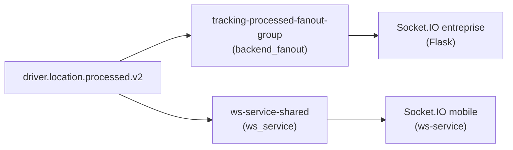

# Contrat événements WebSocket (backend → ws-service)

| event_type | room_target | transport | criticality | dedup_required |
|------------|-------------|-----------|-------------|----------------|
| booking_updated | company_{id} | redis_relay | critical | yes |
| booking_cancelled | company_{id} | redis_relay | critical | yes |
| team_chat_message | company_{id} | redis_relay | critical | yes |
| team_chat_typing | company_{id} | redis_relay | normal | no |
| dispatch_assignment | company_{id} | redis_relay | critical | yes |
| dispatch_run_started | company_{id} | redis_relay | critical | yes |
| dispatch_run_completed | company_{id} | redis_relay | critical | yes |
| dispatch_run_failed | company_{id} | redis_relay | critical | yes |
| driver_location_update | company_{id} | kafka | high | yes |
| driver_live_state_update | company_{id} | kafka | high | yes |

Payload requis : `event_id`, `timestamp` (via `SocketEvent.create`).

---

## Architecture double fanout `driver.location.processed` (P1-2)

Deux consumers indépendants consomment le **même topic** `driver.location.processed.v2` avec des **groupes distincts** :

| Émetteur | Consumer group | Process | Cible Socket.IO |
|----------|----------------|---------|-----------------|
| `backend_fanout` | `tracking-processed-fanout-group` | [`processed_fanout_consumer.py`](../../backend/services/tracking/processed_fanout_consumer.py) | Portail entreprise Flask (room `company_{id}`) |
| `ws_service` | `ws-service-shared` | [`services/ws-service/main.py`](../../services/ws-service/main.py) | App mobile / clients ws-service |

### Déduplication frontend

Les clients **doivent dédupliquer** via `event_id` (ou `tracking_event_id`) car les deux émetteurs peuvent livrer le même événement position à des clients connectés aux deux stacks.

| Client | Risque duplication | Mitigation |
|--------|-------------------|------------|
| Portail web entreprise | Faible (un seul stack en prod actuellement) | Dédup par `event_id` recommandée |
| App mobile chauffeur | Faible (ws-service uniquement) | Dédup par `event_id` |
| Client hybride (tests) | **Élevé** | Filtrer par `source` ou dédup stricte |

### Mesure (comportement inchangé)

Compteur Prometheus `tracking_fanout_emit_total{emitter="backend_fanout|ws_service"}` :

- Backend fanout : [`driver_location_metrics.py`](../../backend/services/monitoring/driver_location_metrics.py) — scrape port **9116**
- ws-service : endpoint `/metrics` port **8001**

**Décision source officielle** : reportée — utiliser le ratio `rate(tracking_fanout_emit_total[5m])` par émetteur pour quantifier la duplication avant toute bascule.
