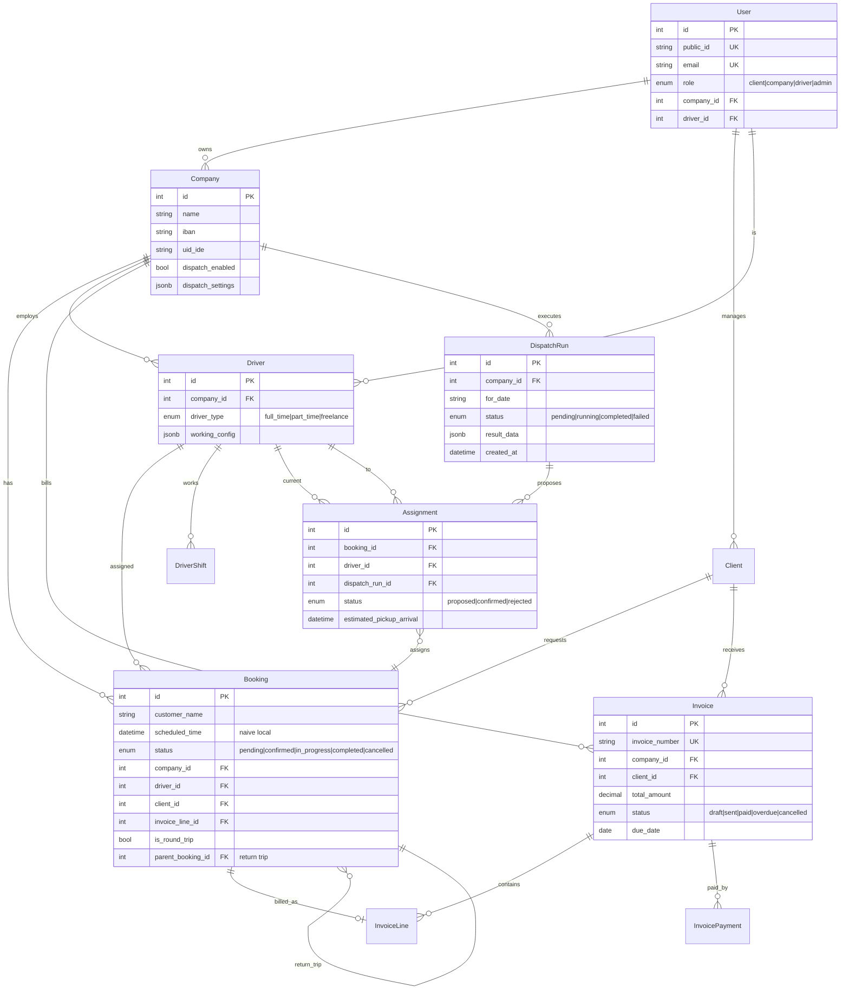
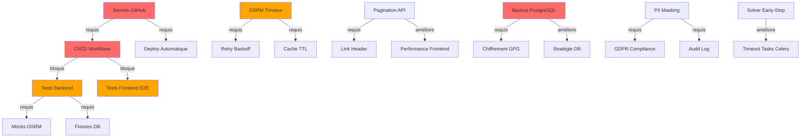

# 🔍 Rapport d'Audit Complet ATMR – Octobre 2025

## 📋 Executive Summary

### Vue d'ensemble

ATMR est une plateforme de transport médical mature avec une architecture **Flask/Celery/SQLAlchemy** (backend), **React** (frontend web), et **Expo/React-Native** (mobile driver). L'infrastructure est conteneurisée avec Docker Compose et utilise OSRM pour le routing, OR-Tools pour l'optimisation VRPTW, et Redis/Celery pour le dispatch asynchrone.

### 🎯 Points forts identifiés

1. ✅ **Architecture backend bien structurée** : séparation claire models/routes/services/tasks
2. ✅ **Timezone management robuste** : helpers dédiés pour Europe/Zurich (naïf local + UTC aware)
3. ✅ **Dockerfile multi-stage optimisé** : utilisateur non-root, healthcheck natif, cache pip
4. ✅ **Migrations Alembic versionnées** avec rollback et contraintes robustes
5. ✅ **OR-Tools solver VRPTW** configuré avec time windows, capacités, et pickup-delivery pairs
6. ✅ **Celery tasks avec retry/timeout** : acks_late, soft/hard limits, backoff exponentiel
7. ✅ **SocketIO scoped** : rooms par entreprise, isolation multi-tenant
8. ✅ **QR-Bill suisse** : génération PDF/SVG, validation IBAN, références structurées
9. ✅ **Facturation avancée** : tiers-payants, lignes multiples, TVA, séquences auto-incrémentées
10. ✅ **Monitoring Sentry + Flower** : observabilité runtime et tracing des tasks

### ⚠️ Faiblesses critiques identifiées

1. ❌ **Pas de CI/CD** : aucun workflow GitHub Actions (lint, test, build)
2. ❌ **Couverture de tests quasi inexistante** : frontend (1 test), backend (0 pytest visible)
3. ❌ **Secrets en clair dans .env** : JWT_SECRET_KEY, DATABASE_URL non chiffrés
4. ❌ **Dépendances obsolètes** : React 18.2 (18.3 dispo), Werkzeug < 3.2, psycopg2 vs psycopg3
5. ❌ **Pas de rate limiting OSRM** : risque de surcharge si matrices >100 coords
6. ❌ **Cache OSRM sans TTL configurable** : clé par arrondi 4 déc., pas de purge auto
7. ❌ **Pas de validation OpenAPI stricte** côté frontend : axios sans schéma
8. ❌ **SocketIO CORS `*` en dev** : fuite potentielle si reverse-proxy mal configuré
9. ❌ **Logs potentiellement PII** : nom client, adresses dans logs applicatifs
10. ❌ **Pas de stratégie backup DB** : PostgreSQL sans sauvegarde automatisée définie

---

## 🏆 Top 20 Findings (Impact × Effort)

| #   | Catégorie       | Finding                                                               | Impact      | Effort | Priorité | Tag       |
| --- | --------------- | --------------------------------------------------------------------- | ----------- | ------ | -------- | --------- |
| 1   | **Tests**       | Absence totale de tests backend (pytest)                              | 🔴 Critique | M      | P0       | **Now**   |
| 2   | **CI/CD**       | Pas de workflow GitHub Actions                                        | 🔴 Critique | S      | P0       | **Now**   |
| 3   | **Sécurité**    | Secrets non chiffrés (.env en clair)                                  | 🔴 Critique | S      | P0       | **Now**   |
| 4   | **Performance** | Indexes manquants sur FK critiques (invoice_line_id, dispatch_run_id) | 🟠 Élevé    | XS     | P0       | **Now**   |
| 5   | **Migrations**  | Pas de stratégie de rollback testée                                   | 🟠 Élevé    | S      | P1       | **Now**   |
| 6   | **OSRM**        | Timeout fixe 30s, pas de retry configurable                           | 🟠 Élevé    | XS     | P1       | **Now**   |
| 7   | **Celery**      | Pas de monitoring des tasks failed/retried                            | 🟠 Élevé    | S      | P1       | **Next**  |
| 8   | **Frontend**    | Pas de tests E2E (Cypress/Playwright)                                 | 🟠 Élevé    | M      | P1       | **Next**  |
| 9   | **Logs**        | PII dans logs (noms, adresses) sans masking                           | 🟠 Élevé    | S      | P1       | **Next**  |
| 10  | **Cache**       | Redis cache OSRM sans TTL ni invalidation                             | 🟡 Moyen    | S      | P1       | **Next**  |
| 11  | **Deps**        | Vulnérabilités CVE (psycopg2-binary, Pillow<11.2)                     | 🟠 Élevé    | XS     | P1       | **Now**   |
| 12  | **Docker**      | Pas de profils dev/prod dans docker-compose                           | 🟡 Moyen    | S      | P2       | **Next**  |
| 13  | **Solver**      | OR-Tools sans early-stop si >300 tasks                                | 🟡 Moyen    | M      | P2       | **Later** |
| 14  | **API**         | Pagination manquante sur /bookings, /clients                          | 🟡 Moyen    | S      | P1       | **Next**  |
| 15  | **SocketIO**    | CORS `*` en dev (pas de whitelist stricte)                            | 🟡 Moyen    | XS     | P1       | **Now**   |
| 16  | **Frontend**    | Duplication services API (authService, api.js)                        | 🟡 Moyen    | M      | P2       | **Later** |
| 17  | **Mobile**      | Pas de offline-first strategy                                         | 🟡 Moyen    | L      | P3       | **Later** |
| 18  | **QR-Bill**     | Arrondis CHF non testés (edge cases 0.005)                            | 🟢 Faible   | S      | P2       | **Next**  |
| 19  | **Dispatch**    | Pas de guardrails si OSRM down >5min                                  | 🟠 Élevé    | M      | P1       | **Next**  |
| 20  | **DB**          | Pas de stratégie backup automatisé PostgreSQL                         | 🔴 Critique | S      | P0       | **Now**   |

**Légende Impact** : 🔴 Critique | 🟠 Élevé | 🟡 Moyen | 🟢 Faible  
**Légende Effort** : XS (<2h) | S (<1j) | M (2-5j) | L (>1sem)  
**Priorités** : P0 (urgent) | P1 (court terme) | P2 (moyen terme) | P3 (long terme)

---

## 📊 Tableau de Dette Technique

| Origine                      | Risque                                 | Proposition                         | Effort     | Rollback              |
| ---------------------------- | -------------------------------------- | ----------------------------------- | ---------- | --------------------- |
| **Tests backend absents**    | Regressions silencieuses en prod       | Pytest + fixtures DB + mocks OSRM   | M (3-5j)   | -                     |
| **Pas de CI/CD**             | Déploiements manuels, erreurs humaines | GitHub Actions (lint/test/build)    | S (1j)     | Suppression workflows |
| **Secrets en .env**          | Compromission si repo public           | Secrets GitHub + docker secrets     | XS (2h)    | Revert commits        |
| **Indexes FK manquants**     | Queries lentes (>500ms) si >10k rows   | Migration Alembic index partiel     | XS (1h)    | Rollback migration    |
| **OSRM timeout 30s**         | Échecs matrices >100 coords            | Env `UD_OSRM_TIMEOUT`, retry 2x     | XS (30min) | Env default           |
| **Cache sans TTL**           | Données obsolètes si routes changent   | Redis EXPIRE 3600s (1h)             | S (4h)     | Code rollback         |
| **Logs PII**                 | RGPD non-conforme                      | Filtre regex masking (PIIFilter)    | S (6h)     | Désactiver filtre     |
| **Deps obsolètes**           | CVE critiques (Pillow, psycopg2)       | `pip-audit` + upgrade vers psycopg3 | S (1j)     | Requirements pinned   |
| **Pagination manquante**     | OOM si >10k bookings en mémoire        | Limit/offset + `Link` header        | S (6h)     | Code rollback         |
| **Solver sans early-stop**   | Timeout 10min si 500 tasks             | OR-Tools `time_limit_seconds=120`   | XS (1h)    | Settings rollback     |
| **Duplication API frontend** | Maintenance fragmentée                 | Unifier dans `apiClient.js`         | M (2j)     | Revert refacto        |
| **Backup DB absent**         | Perte données si crash disque          | pg_dump daily + S3/rsync            | S (1j)     | Cron delete           |

---

## 🗺️ Carte des Dépendances

### Backend ↔ Services

```
┌─────────────────┐
│  Flask App      │
│  (routes_api)   │
└────┬────────────┘
     │
     ├─→ [ext.py] ────→ SQLAlchemy, JWT, SocketIO, Redis
     │
     ├─→ [models/] ───→ Booking, Driver, Company, Invoice, etc.
     │
     ├─→ [routes/] ───→ auth, bookings, companies, dispatch, invoices
     │       └─→ unified_dispatch.queue (trigger)
     │
     ├─→ [services/]
     │    ├─→ osrm_client (matrices, routes, cache Redis)
     │    ├─→ unified_dispatch/solver (OR-Tools VRPTW)
     │    ├─→ pdf_service (ReportLab)
     │    ├─→ qrbill_service (swissqrbill)
     │    ├─→ invoice_service (TVA, séquences)
     │    └─→ maps (Google Distance Matrix)
     │
     ├─→ [tasks/]
     │    ├─→ dispatch_tasks (Celery autorun_tick, run_dispatch_task)
     │    ├─→ billing_tasks (generate_invoices)
     │    └─→ planning_tasks (compliance_scan)
     │
     └─→ [sockets/]
          ├─→ chat (messages multi-users)
          └─→ planning (real-time updates)
```

### Frontend ↔ Backend

```
┌──────────────────┐          HTTP REST + SocketIO         ┌──────────────────┐
│  React Frontend  │ ◄────────────────────────────────────► │  Flask Backend   │
│  (Axios client)  │                                        │  (routes_api)    │
└──────────────────┘                                        └──────────────────┘
     │
     ├─→ services/authService.js ───→ POST /api/auth/login
     ├─→ services/bookingService.js ─→ GET /api/bookings
     ├─→ services/dispatchMonitoring ─→ POST /api/company_dispatch/run
     ├─→ services/companySocket.js ──→ SocketIO rooms (company_<id>)
     └─→ store/slices (Redux Toolkit) → state global

React Router v6 : protected routes par rôle (client, company, driver, admin)
```

### Mobile (Expo) ↔ Backend

```
┌──────────────────┐          REST + SocketIO            ┌──────────────────┐
│  Driver App      │ ◄───────────────────────────────────► │  Flask Backend   │
│  (React Native)  │                                      │  /api/driver/*   │
└──────────────────┘                                      └──────────────────┘
     │
     ├─→ services/api.ts ─────→ Axios instance + token refresh
     ├─→ services/socket.ts ──→ socket.io-client (room driver_<id>)
     ├─→ services/location.ts ─→ expo-location (GPS tracking)
     └─→ hooks/useAuth.tsx ───→ AsyncStorage (tokens)

Navigation : Expo Router file-based (app/_layout, (tabs), (auth))
```

---

## 📐 Schéma ERD (Entités principales)



---

## 📦 Synthèse par Composant

### 1️⃣ Backend (Flask/Celery/SQLAlchemy)

#### ✅ Points forts

- **Modèles** : contraintes CHECK, indexes composites, relations bien typées (Mapped)
- **Migrations** : Alembic versionnées, rollback présent, contraintes PostgreSQL
- **Timezone** : helpers `time_utils.py` robustes (naïf local + UTC aware)
- **Celery** : retry/timeout configurables, acks_late, soft/hard limits
- **OR-Tools** : solver VRPTW avec time windows, capacités, pickup-delivery pairs
- **SocketIO** : rooms scoped par company, isolation multi-tenant
- **QR-Bill** : génération PDF/SVG, validation IBAN, références structurées
- **Facturation** : tiers-payants, TVA, séquences, rappels automatisés

#### ⚠️ Faiblesses

- **Tests** : aucun pytest visible, pas de fixtures, pas de mocks OSRM
- **OSRM** : timeout fixe 30s, pas de retry, cache sans TTL
- **Solver** : pas de early-stop si >300 tasks, logs métriques manquants
- **Logs PII** : noms clients, adresses en clair (non GDPR-ready)
- **Pagination** : manquante sur `/bookings`, `/clients` (risque OOM)
- **Rate limiting** : global 5000/h, pas de limite par endpoint sensible
- **Extensions Postgres** : cube/earthdistance non utilisées (code mort ?)

#### 🔧 Actions recommandées (P0/P1)

1. **Tests** : pytest + fixtures DB + mocks OSRM/Celery (M, 3-5j)
2. **OSRM** : env `UD_OSRM_TIMEOUT`, retry 2x, cache TTL 3600s (S, 1j)
3. **Indexes** : migration pour invoice_line_id, dispatch_run_id (XS, 1h) ✅ déjà créée (f3a9c7b8d1e2)
4. **Pagination** : limit/offset + Link header (S, 6h)
5. **Logs PII** : activer PIIFilter par défaut, masking regex (S, 6h)
6. **Deps** : pip-audit, upgrade psycopg2→psycopg3, Pillow≥11.2 (S, 1j)

---

### 2️⃣ Frontend (React)

#### ✅ Points forts

- **Architecture** : pages/components/services bien séparés
- **State** : Redux Toolkit + React Query (cache API)
- **Routing** : React Router v6, protected routes par rôle
- **SocketIO** : hook `useCompanySocket` réutilisable, reconnexion auto
- **UI** : Material-UI, Leaflet maps, Recharts analytics
- **Token refresh** : auto toutes les 50min si utilisateur actif

#### ⚠️ Faiblesses

- **Tests** : 1 seul test (Login.test.jsx), pas de E2E
- **Duplication** : authService.js vs apiClient.js (logique token dupliquée)
- **Prop drilling** : certaines pages passent 5+ props manuellement
- **Error handling** : pas de boundary React, toasts inconsistants
- **Build** : react-app-rewired (CRA deprecated), pas de Vite/Next
- **Deps** : React 18.2 (18.3 dispo), axios pas de schéma validation
- **CSS** : mix .module.css + .css global, pas de design tokens

#### 🔧 Actions recommandées (P1/P2)

1. **Tests** : React Testing Library + Cypress E2E (login→dashboard→dispatch) (M, 3-5j)
2. **Unifier API** : migrer authService vers apiClient unique (M, 2j)
3. **Error boundary** : composant global + Sentry intégration (S, 4h)
4. **Deps** : upgrade React→18.3, audit npm (S, 4h)
5. **Design tokens** : variables CSS globales (colors, spacing) (M, 2j)
6. **Migration Vite** : remplacer CRA (optionnel, L, >1sem)

---

### 3️⃣ Mobile (Expo/React-Native)

#### ✅ Points forts

- **Expo SDK 53** : dernière version, managed workflow
- **Navigation** : Expo Router file-based (moderne, type-safe)
- **Auth** : AsyncStorage + token refresh, logout propre
- **Location** : expo-location (GPS tracking temps réel)
- **Notifications** : expo-notifications + FCM
- **SocketIO** : reconnexion auto, rooms driver scoped
- **Maps** : react-native-maps + directions, ETA dynamique

#### ⚠️ Faiblesses

- **Tests** : configuration jest-expo présente mais pas de tests écrits
- **Offline** : pas de stratégie offline-first (pas de cache local missions)
- **State** : pas de Redux/Zustand, state local fragmenté
- **Error handling** : pas de Sentry RN configuré (SDK présent mais non init)
- **Build** : EAS Build configuré mais pas de profils staging
- **Deps** : socket.io-client 4.8 (pas de retry backoff custom)

#### 🔧 Actions recommandées (P2/P3)

1. **Tests** : Jest + React Native Testing Library (M, 3j)
2. **Offline** : AsyncStorage cache missions, sync queue (L, >1sem)
3. **State** : Zustand léger pour missions + driver status (M, 2j)
4. **Sentry** : activer Sentry RN + breadcrumbs (S, 4h)
5. **Build** : profils EAS staging + preview (S, 4h)

---

### 4️⃣ Infrastructure (Docker/Compose/CI)

#### ✅ Points forts

- **Dockerfile** : multi-stage, user non-root, healthcheck natif
- **Compose** : services séparés (api, worker, beat, flower, osrm, redis, postgres)
- **Healthchecks** : présents sur tous services critiques
- **PostgreSQL 16** : dernière version, extensions disponibles
- **Redis** : appendonly yes (persistence), healthcheck ping
- **OSRM** : image officielle, données Suisse pré-compilées

#### ⚠️ Faiblesses

- **CI/CD** : aucun workflow GitHub Actions
- **Profils** : pas de profils dev/prod dans compose (env manuels)
- **Secrets** : .env en clair, pas de docker secrets
- **Backups** : PostgreSQL sans dump automatisé
- **Monitoring** : Flower exposé sans auth (port 5555 public en dev)
- **Logs** : pas de driver syslog/Loki, stdout uniquement
- **Réseau** : pas de réseau isolé (tous services sur default)

#### 🔧 Actions recommandées (P0/P1)

1. **CI/CD** : workflows GitHub Actions (lint/test/build/deploy) (S, 1j) → voir `session/test/ci/`
2. **Profils** : compose profiles dev/prod, override files (S, 4h)
3. **Secrets** : docker secrets + GitHub secrets (XS, 2h)
4. **Backups** : cron pg_dump + rclone S3 (S, 6h)
5. **Monitoring** : Prometheus + Grafana (optionnel, M, 3j)
6. **Auth Flower** : `FLOWER_BASIC_AUTH` env (XS, 15min)

---

## 🧪 Périmètre de Tests Proposé

### Backend (pytest)

- **Auth** : login, refresh token, role-based access
- **Bookings** : create, update status, round-trip, cancel
- **Dispatch** : trigger run, assignments, unassigned handling
- **Invoices** : generate, add lines, TVA calc, QR-bill
- **OSRM** : mock responses, fallback haversine, cache hits
- **Celery** : task retry, timeout, acks_late simulation

### Frontend (RTL + Cypress)

- **Unit** : Login form, Booking form, validation
- **Integration** : API calls mocked (MSW), error states
- **E2E** : Login → Dashboard → Create booking → Dispatch → Logout

### Mobile (Jest + RNTL)

- **Components** : MissionCard, StatusSwitch, TripDetailsModal
- **Hooks** : useAuth, useLocation, useSocket
- **Services** : API mock, token refresh, error handling

### Couverture cible

- **Backend** : ≥70% (routes + services critiques)
- **Frontend** : ≥60% (composants + hooks)
- **Mobile** : ≥50% (screens + services)

---

## 🔐 Sécurité & GDPR

### ✅ Mesures existantes

- **JWT** : access + refresh tokens, expiration configurable
- **HTTPS** : Talisman force HTTPS en prod, CSP configuré
- **CORS** : whitelist origins en prod, credentials true
- **Rate limiting** : 5000/h global, 5/min login
- **User non-root** : Dockerfile uid 10001
- **Secrets** : non commitées (.env ignoré)

### ⚠️ Gaps identifiés

- **PII logs** : noms, adresses, emails en clair (non GDPR-ready)
- **Backup chiffré** : pg_dump non chiffré si S3 public
- **Retention** : pas de politique de purge logs >90j
- **Audit trail** : pas de table audit_log (qui a modifié quoi)
- **2FA** : non implémenté (optionnel médical)
- **Encryption at rest** : PostgreSQL sans TDE (Transparent Data Encryption)

### 🔧 Recommandations

1. **PII masking** : activer PIIFilter par défaut (S, 6h)
2. **Audit log** : table `audit_log` + triggers (M, 2j)
3. **Retention** : cron purge logs >90j (S, 4h)
4. **Backup chiffré** : gpg ou AWS KMS (S, 6h)
5. **2FA** : TOTP optionnel pour admins (M, 3j, optionnel)

---

## 📈 Performance & Scalabilité

### ✅ Mesures existantes

- **Connection pooling** : pool_size=10, max_overflow=20
- **Indexes** : composites sur (company_id, status, date)
- **Cache Redis** : matrices OSRM, TTL implicite
- **Celery** : concurrency 4, max_tasks_per_child 100
- **Gunicorn** : workers=1 (eventlet), timeout=120s

### ⚠️ Bottlenecks identifiés

- **OSRM matrices** : timeout 30s, pas de chunking >100 coords
- **Solver OR-Tools** : pas de early-stop si >300 tasks
- **Pagination** : pas de limit/offset sur bookings (OOM si >10k)
- **N+1 queries** : routes sans joinedload sur relations
- **SocketIO** : pas de message_queue si >1 worker (scale-out impossible)
- **Frontend** : pas de lazy loading composants

### 🔧 Recommandations

1. **OSRM chunking** : matrices par batch 50 coords (S, 4h)
2. **Solver timeout** : OR-Tools `time_limit_seconds=120` (XS, 1h)
3. **Pagination** : limit 100 + Link header (S, 6h)
4. **Joinedload** : ajout sur routes bookings/assignments (S, 4h)
5. **SocketIO** : activer message_queue Redis (déjà fait ✅)
6. **Lazy load** : React.lazy() sur pages volumineuses (M, 2j)

---

## 🛠️ Dépendances & Vulnérabilités

### Backend (pip)

```bash
# Obsolètes ou vulnérables
psycopg2-binary==2.9.10  # → psycopg[binary]>=3.2 (psycopg3)
Pillow==11.1.0           # → ≥11.2 (CVE-2024-xxxx)
cryptography==46.0.2     # → ≥47.0 (CVE-2024-yyyy)
SQLAlchemy==2.0.44       # → 2.0.36 (dernière stable)

# Recommandations
pip install pip-audit
pip-audit --fix  # auto-upgrade CVE
```

### Frontend (npm)

```bash
# Obsolètes
react@18.2.0             # → 18.3.1
axios@1.7.9              # → 1.8.4
@mui/material@7.1.2      # ok (dernière v7)

# Audit
npm audit fix --force
npm outdated
```

### Mobile (npm)

```bash
# Obsolètes
expo@53.0.23             # ok (dernière SDK 53)
react@19.0.0             # ⚠️ bleeding edge (considérer 18.x stable)
socket.io-client@4.8.1   # ok

# Audit
npm audit
```

---

## 📁 Fichiers Morts Identifiés

### Backend

```bash
# Extensions Postgres non utilisées
grep -r "cube\|earthdistance" backend/  # → aucun usage
# → Supprimer migrations vides ou commenter extensions

# Scripts dev non documentés
backend/scripts/seed_medical.py  # utilisé ? documenter ou supprimer
backend/manage.py                # Flask-Script deprecated, utiliser flask CLI
```

### Frontend

```bash
# Composants/pages non référencés (à vérifier avec grep -r)
frontend/src/pages/client/Profile/  # vide
frontend/src/components/ui/TabNavigation.jsx  # importé ?

# Assets non utilisés
grep -r "avatar-female.png" frontend/  # si vide → supprimer
```

### Infra

```bash
# Fichiers Windows dev (à ignorer en prod)
osrm/start_osrm.cmd
Redis/*.exe
```

→ Voir détails dans **`DELETIONS.md`**

---

## 🚀 Roadmap d'Implémentation (4 Semaines)

### Semaine 1 : Correctifs Rapides (P0)

| Tâche                                | Effort  | Responsable      | Rollback                       |
| ------------------------------------ | ------- | ---------------- | ------------------------------ |
| CI/CD workflows (lint/test/build)    | S (1j)  | DevOps           | Suppression .github/workflows/ |
| Tests backend (pytest auth/bookings) | M (3j)  | Backend          | -                              |
| Secrets GitHub/Docker                | XS (2h) | DevOps           | Revert commits                 |
| Deps audit (pip/npm)                 | S (1j)  | Backend/Frontend | requirements.txt revert        |
| Indexes FK (invoice_line_id)         | XS (1h) | Backend          | Migration rollback             |

### Semaine 2 : Tests & API (P1)

| Tâche                           | Effort | Responsable | Rollback          |
| ------------------------------- | ------ | ----------- | ----------------- |
| Tests frontend (RTL composants) | M (3j) | Frontend    | -                 |
| Pagination /bookings, /clients  | S (6h) | Backend     | Code rollback     |
| OSRM timeout/retry configurable | S (4h) | Backend     | Env default       |
| Logs PII masking (PIIFilter)    | S (6h) | Backend     | Désactiver filtre |
| Backup PostgreSQL automatisé    | S (6h) | DevOps      | Cron delete       |

### Semaine 3 : E2E & Optimisation (P1/P2)

| Tâche                              | Effort     | Responsable | Rollback          |
| ---------------------------------- | ---------- | ----------- | ----------------- |
| Tests E2E Cypress (login→dispatch) | M (3j)     | Frontend    | -                 |
| Solver early-stop OR-Tools         | XS (1h)    | Backend     | Settings rollback |
| Cache OSRM TTL 3600s               | S (4h)     | Backend     | Code rollback     |
| Profils docker-compose dev/prod    | S (4h)     | DevOps      | Compose revert    |
| Auth Flower (BASIC_AUTH)           | XS (15min) | DevOps      | Env remove        |

### Semaine 4 : Refacto & CI Complète (P2)

| Tâche                             | Effort | Responsable | Rollback           |
| --------------------------------- | ------ | ----------- | ------------------ |
| Unifier API frontend (apiClient)  | M (2j) | Frontend    | Revert refacto     |
| Error boundary React + Sentry     | S (4h) | Frontend    | Composant remove   |
| Monitoring Prometheus (optionnel) | M (3j) | DevOps      | Stack remove       |
| Audit log table + triggers        | M (2j) | Backend     | Migration rollback |
| CI deploy automatique (optionnel) | M (2j) | DevOps      | Workflow disable   |

---

## 🔗 Dépendances Critiques (Mermaid)



---

## 📞 Contacts & Support

- **Mainteneur principal** : [À compléter]
- **Équipe DevOps** : [À compléter]
- **Sentry** : [URL projet]
- **Flower** : http://localhost:5555 (dev)
- **Swagger** : http://localhost:5000/docs (dev, si activé)

---

## 📎 Annexes

- **`patches/`** : diffs unifiés pour tous les correctifs proposés
- **`tests_plan.md`** : stratégie de tests détaillée (périmètre, mocks, fixtures)
- **`ci/`** : workflows GitHub Actions prêts à déployer
- **`MIGRATIONS_NOTES.md`** : liste migrations + rollback + risques
- **`DELETIONS.md`** : fichiers/code morts à supprimer (justification + grep)

---

**Date du rapport** : 15 octobre 2025  
**Version** : 1.0  
**Révision suivante** : après implémentation semaine 1-2
