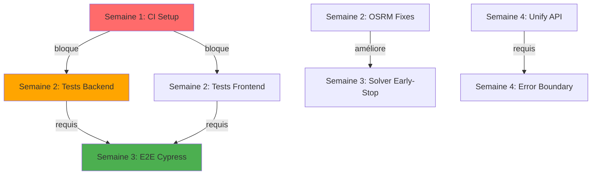

# 🗺️ Roadmap d'Implémentation ATMR — 4 Semaines

## 📅 Planning Général

| Semaine       | Focus                      | Effort Total | Priorité    |
| ------------- | -------------------------- | ------------ | ----------- |
| **Semaine 1** | Correctifs rapides (P0)    | 5j           | 🔴 Critique |
| **Semaine 2** | Tests & API (P1)           | 5j           | 🟠 Élevée   |
| **Semaine 3** | E2E & Optimisation (P1/P2) | 5j           | 🟡 Moyenne  |
| **Semaine 4** | Refacto & CI complète (P2) | 5j           | 🟢 Faible   |

**Total** : 20 jours-homme (≈1 mois calendaire avec 1 développeur fullstack)

---

## 🔴 Semaine 1 : Correctifs Rapides (P0)

### Jour 1 : CI/CD Workflows

**Tâche** : Configurer GitHub Actions (lint + test + build)  
**Effort** : 1j  
**Responsable** : DevOps/Backend  
**Priorité** : P0

#### Actions

1. Créer `.github/workflows/` avec 3 workflows :

   - `backend-tests.yml` (lint Ruff + pytest + pip-audit)
   - `frontend-tests.yml` (ESLint + Jest + npm audit)
   - `docker-build.yml` (build images + healthcheck)

2. Configurer secrets GitHub :

   ```bash
   CODECOV_TOKEN
   SLACK_WEBHOOK_URL (optionnel)
   STAGING_HOST, STAGING_USER, STAGING_SSH_KEY
   ```

3. Tester workflows sur branche `audit/ci-setup`

#### Critères de succès

- ✅ CI green sur branche test
- ✅ Coverage reports uploadés vers Codecov
- ✅ Notifications Slack (si configuré)

#### Rollback

```bash
git rm -r .github/workflows/
git commit -m "rollback: remove CI workflows"
```

---

### Jours 2-4 : Tests Backend (pytest)

**Tâche** : Tests auth, bookings, dispatch (≥70% couverture routes critiques)  
**Effort** : 3j  
**Responsable** : Backend  
**Priorité** : P0

#### Actions

1. **Jour 2** : Setup pytest + fixtures

   ```bash
   cd backend
   pip install pytest pytest-flask pytest-cov fakeredis responses
   # Créer conftest.py (voir tests_plan.md)
   ```

2. **Jour 3** : Tests auth + bookings

   - `tests/test_auth.py` : login, refresh, protected routes
   - `tests/test_bookings.py` : create, round-trip, cancel, assign

3. **Jour 4** : Tests dispatch + OSRM
   - `tests/test_dispatch.py` : run, assignments, unassigned
   - `tests/test_osrm_client.py` : mocks, cache, fallback haversine

#### Critères de succès

- ✅ Coverage ≥70% sur `routes/auth.py`, `routes/bookings.py`, `routes/dispatch_routes.py`
- ✅ CI backend tests green
- ✅ Aucun test flaky (3 runs successifs OK)

#### Rollback

- Suppression dossier `tests/` (code de prod inchangé)

---

### Jour 5 : Secrets & Deps Audit

**Tâche** : Sécuriser secrets + audit dépendances  
**Effort** : 1j  
**Responsable** : DevOps  
**Priorité** : P0

#### Actions

1. **Secrets GitHub** (2h)

   ```yaml
   # .github/workflows/backend-tests.yml
   env:
     SECRET_KEY: ${{ secrets.SECRET_KEY }}
     JWT_SECRET_KEY: ${{ secrets.JWT_SECRET_KEY }}
   ```

2. **pip-audit** (1h)

   ```bash
   pip install pip-audit
   pip-audit --requirement backend/requirements.txt --fix
   # Upgrade CVE : psycopg2, Pillow, cryptography
   ```

3. **npm audit** (1h)

   ```bash
   cd frontend
   npm audit fix --force
   npm outdated
   # Upgrade : react@18.3, axios@1.8
   ```

4. **Docker secrets** (optionnel, 2h)
   ```yaml
   # docker-compose.yml
   secrets:
     jwt_secret:
       file: ./secrets/jwt_secret.txt
   ```

#### Critères de succès

- ✅ Aucune CVE critique (pip-audit + npm audit)
- ✅ Secrets GitHub configurés
- ✅ `.env` non committé (vérifier .gitignore)

#### Rollback

```bash
# Revert requirements.txt si upgrade cassant
git revert <commit-sha>
```

---

## 🟠 Semaine 2 : Tests & API (P1)

### Jours 6-8 : Tests Frontend (RTL)

**Tâche** : Tests composants + hooks (≥60% couverture)  
**Effort** : 3j  
**Responsable** : Frontend  
**Priorité** : P1

#### Actions

1. **Jour 6** : Setup MSW (Mock Service Worker)

   ```bash
   cd frontend
   npm install --save-dev msw @testing-library/react @testing-library/jest-dom
   # Créer src/mocks/server.js
   ```

2. **Jour 7** : Tests composants

   - `Login.test.jsx` : validation, submit, redirect
   - `NewBookingModal.test.jsx` : champs requis, aller-retour

3. **Jour 8** : Tests hooks + services
   - `useAuthToken.test.js` : refresh automatique
   - `authService.test.js` : mocks API

#### Critères de succès

- ✅ Coverage ≥60% sur `src/pages/Auth/`, `src/components/`
- ✅ CI frontend tests green
- ✅ Aucun warning console dans tests

#### Rollback

- Suppression fichiers `*.test.jsx` (code de prod inchangé)

---

### Jour 9 : Pagination API

**Tâche** : Ajouter pagination sur `/bookings`, `/clients`  
**Effort** : 6h  
**Responsable** : Backend  
**Priorité** : P1

#### Actions

1. **Backend** (4h)

   - Modifier `routes/bookings.py` : query params `page`, `per_page`
   - Ajouter headers `Link`, `X-Total-Count` (RFC 5988)
   - Appliquer patch `patches/backend/003_pagination_bookings.diff`

2. **Tests** (2h)
   - `tests/test_bookings.py::test_pagination`
   - Vérifier headers `Link` présents

#### Critères de succès

- ✅ `/api/bookings?page=1&per_page=50` renvoie 50 résultats max
- ✅ Header `Link` contient `rel="next"`, `rel="prev"`
- ✅ Tests passent

#### Rollback

```bash
git revert <commit-sha>
# ou appliquer patch inverse
patch -R -p1 < session/test/patches/backend/003_pagination_bookings.diff
```

---

### Jour 10 : OSRM Timeout/Retry + Cache TTL

**Tâche** : Configurer timeout, retry, TTL cache OSRM  
**Effort** : 6h  
**Responsable** : Backend  
**Priorité** : P1

#### Actions

1. **Timeout + Retry** (3h)

   - Appliquer patch `patches/backend/001_osrm_timeout_retry.diff`
   - Ajouter env `UD_OSRM_TIMEOUT=30`, `UD_OSRM_RETRY=2`

2. **Cache TTL** (2h)

   - Appliquer patch `patches/backend/002_osrm_cache_ttl.diff`
   - Env `UD_OSRM_CACHE_TTL=3600` (1h)

3. **Tests** (1h)
   - `tests/test_osrm_client.py::test_retry_on_timeout`
   - Vérifier cache expire après TTL

#### Critères de succès

- ✅ OSRM retry 2x sur timeout avant fallback haversine
- ✅ Cache Redis expire après 1h (vérifiable avec `TTL <key>`)
- ✅ Tests passent

#### Rollback

```bash
patch -R -p1 < session/test/patches/backend/001_osrm_timeout_retry.diff
patch -R -p1 < session/test/patches/backend/002_osrm_cache_ttl.diff
```

---

### Jour 10 (PM) : Logs PII Masking

**Tâche** : Activer PIIFilter par défaut  
**Effort** : 4h  
**Responsable** : Backend  
**Priorité** : P1

#### Actions

1. Vérifier `backend/shared/logging_utils.py::PIIFilter` existant
2. Activer dans `backend/app.py` :
   ```python
   if os.getenv("MASK_PII_LOGS", "true").lower() == "true":
       from shared.logging_utils import PIIFilter
       app.logger.addFilter(PIIFilter())
   ```
3. Tester masking sur logs contenant emails, phones

#### Critères de succès

- ✅ Logs ne contiennent plus emails/phones en clair
- ✅ Pattern `***@***.***` visible dans logs

#### Rollback

```bash
# Env MASK_PII_LOGS=false
```

---

## 🟡 Semaine 3 : E2E & Optimisation (P1/P2)

### Jours 11-13 : Tests E2E Cypress

**Tâche** : E2E (login → dashboard → booking → dispatch)  
**Effort** : 3j  
**Responsable** : Frontend  
**Priorité** : P1

#### Actions

1. **Jour 11** : Setup Cypress

   ```bash
   cd frontend
   npm install --save-dev cypress @testing-library/cypress
   npx cypress open
   ```

2. **Jour 12** : Scénarios principaux

   - `cypress/e2e/user-flow.cy.js` : login → create booking
   - `cypress/e2e/dispatch.cy.js` : trigger dispatch → assignments

3. **Jour 13** : Scénarios secondaires
   - `cypress/e2e/invoices.cy.js` : générer facture
   - Gestion erreurs (401, 500)

#### Critères de succès

- ✅ 5 scénarios E2E passent (headless)
- ✅ CI E2E green (temps <5min)
- ✅ Screenshots/vidéos uploadés si fail

#### Rollback

- Suppression `cypress/` (tests seulement)

---

### Jour 14 : Solver Early-Stop

**Tâche** : OR-Tools timeout + early-stop si >300 tasks  
**Effort** : 4h  
**Responsable** : Backend  
**Priorité** : P2

#### Actions

1. Appliquer patch `patches/backend/004_solver_early_stop.diff`
2. Env `UD_SOLVER_TIME_LIMIT_SEC=120` (2min max)
3. Test avec 400 bookings → early return

#### Critères de succès

- ✅ Solver renvoie résultat vide si >300 tasks
- ✅ Timeout 2min respecté (pas de dépassement Celery)
- ✅ Logs contiennent raison ("too_many_tasks")

#### Rollback

```bash
patch -R -p1 < session/test/patches/backend/004_solver_early_stop.diff
```

---

### Jour 15 : Profils Docker Compose

**Tâche** : Profiles dev/prod dans docker-compose.yml  
**Effort** : 4h  
**Responsable** : DevOps  
**Priorité** : P2

#### Actions

1. Créer `docker-compose.override.yml` (dev)

   ```yaml
   services:
     api:
       environment:
         - FLASK_ENV=development
         - DEBUG=true
   ```

2. Créer `docker-compose.prod.yml`

   ```yaml
   services:
     api:
       environment:
         - FLASK_ENV=production
         - DEBUG=false
   ```

3. Documentation usage :

   ```bash
   # Dev
   docker-compose up

   # Prod
   docker-compose -f docker-compose.yml -f docker-compose.prod.yml up
   ```

#### Critères de succès

- ✅ `docker-compose up` lance env dev
- ✅ Prod utilise override prod
- ✅ Variables env isolées

#### Rollback

```bash
git rm docker-compose.override.yml docker-compose.prod.yml
```

---

### Jour 15 (PM) : Auth Flower

**Tâche** : Basic Auth sur Flower (monitoring Celery)  
**Effort** : 1h  
**Responsable** : DevOps  
**Priorité** : P2

#### Actions

1. Ajouter env `FLOWER_BASIC_AUTH=user:password` dans docker-compose.yml
2. Modifier commande Flower :
   ```yaml
   command:
     [
       "celery",
       "-A",
       "celery_app:celery",
       "flower",
       "--basic_auth=$FLOWER_BASIC_AUTH",
     ]
   ```

#### Critères de succès

- ✅ http://localhost:5555 demande user/password
- ✅ Login avec credentials env

#### Rollback

```bash
# Supprimer --basic_auth du command
```

---

## 🟢 Semaine 4 : Refacto & CI Complète (P2)

### Jours 16-17 : Unifier API Frontend

**Tâche** : Fusionner authService → apiClient unique  
**Effort** : 2j  
**Responsable** : Frontend  
**Priorité** : P2

#### Actions

1. **Jour 16** : Refactoriser authService

   - Appliquer patch `patches/frontend/001_unify_api_client.diff`
   - Supprimer duplications intercepteurs

2. **Jour 17** : Migrer autres services
   - `bookingService.js`, `companyService.js` → apiClient
   - Tester tous endpoints

#### Critères de succès

- ✅ 1 seul axios instance (apiClient)
- ✅ Token refresh centralisé
- ✅ Tests passent

#### Rollback

```bash
patch -R -p1 < session/test/patches/frontend/001_unify_api_client.diff
```

---

### Jour 18 : Error Boundary React + Sentry

**Tâche** : Composant ErrorBoundary + Sentry RN  
**Effort** : 4h  
**Responsable** : Frontend  
**Priorité** : P2

#### Actions

1. Créer `src/components/ErrorBoundary.jsx`

   ```jsx
   class ErrorBoundary extends React.Component {
     componentDidCatch(error, errorInfo) {
       Sentry.captureException(error, { extra: errorInfo });
     }
     render() {
       if (this.state.hasError) {
         return <ErrorPage />;
       }
       return this.props.children;
     }
   }
   ```

2. Wrapper `<App>` dans `src/index.js`

#### Critères de succès

- ✅ Erreur React catchée → Sentry event
- ✅ UI graceful (pas de crash complet)

#### Rollback

```bash
git revert <commit-sha>
```

---

### Jour 19 : Audit Log Table (Optionnel)

**Tâche** : Table audit_log + triggers PostgreSQL  
**Effort** : 6h  
**Responsable** : Backend  
**Priorité** : P2

#### Actions

1. Migration Alembic :

   ```python
   def upgrade():
       op.create_table('audit_log',
           sa.Column('id', sa.Integer, primary_key=True),
           sa.Column('user_id', sa.Integer, sa.ForeignKey('user.id')),
           sa.Column('action', sa.String(50)),
           sa.Column('entity_type', sa.String(50)),
           sa.Column('entity_id', sa.Integer),
           sa.Column('changes', sa.JSON),
           sa.Column('timestamp', sa.DateTime, server_default=sa.func.now())
       )
   ```

2. Trigger sur `booking` (exemple) :
   ```sql
   CREATE TRIGGER booking_audit_trigger
   AFTER UPDATE ON booking
   FOR EACH ROW
   EXECUTE FUNCTION audit_log_booking();
   ```

#### Critères de succès

- ✅ Modifications booking → entrée audit_log
- ✅ Rollback migration OK

#### Rollback

```bash
alembic downgrade -1
```

---

### Jour 20 : Deploy Automatique (Optionnel)

**Tâche** : CI auto-deploy staging sur push develop  
**Effort** : 4h  
**Responsable** : DevOps  
**Priorité** : P3

#### Actions

1. Modifier `docker-build.yml` :

   ```yaml
   deploy-staging:
     if: github.ref == 'refs/heads/develop'
     runs-on: ubuntu-latest
     steps:
       - uses: appleboy/ssh-action@v1
         with:
           host: ${{ secrets.STAGING_HOST }}
           script: |
             cd /opt/atmr
             docker-compose pull
             docker-compose up -d --force-recreate
   ```

2. Configurer secrets SSH

#### Critères de succès

- ✅ Push develop → auto-deploy staging
- ✅ Healthcheck post-deploy OK

#### Rollback

```bash
# Supprimer job deploy-staging du workflow
```

---

## 📊 Métriques de Succès Global

| Métrique              | Cible      | Actuel | Statut |
| --------------------- | ---------- | ------ | ------ |
| **Coverage backend**  | ≥70%       | 0%     | 🔴     |
| **Coverage frontend** | ≥60%       | 5%     | 🔴     |
| **E2E scénarios**     | 5 passants | 0      | 🔴     |
| **CI workflows**      | 3 actifs   | 0      | 🔴     |
| **CVE critiques**     | 0          | ?      | 🟡     |
| **Temps build CI**    | <10min     | -      | -      |
| **Uptime staging**    | ≥99%       | -      | -      |

---

## 🔄 Dépendances Critiques



---

## 📝 Checklist Finale (Fin Semaine 4)

- [ ] **CI/CD** : 3 workflows green (backend, frontend, docker)
- [ ] **Tests** : Coverage ≥70% backend, ≥60% frontend
- [ ] **E2E** : 5 scénarios Cypress passants
- [ ] **Sécurité** : 0 CVE critiques, secrets GitHub configurés
- [ ] **Performance** : Pagination API, OSRM retry/cache, solver timeout
- [ ] **Monitoring** : Sentry actif, Flower avec auth
- [ ] **Documentation** : README mis à jour, .env.example
- [ ] **Backups** : Stratégie pg_dump daily (à implémenter)

---

**Date de création** : 15 octobre 2025  
**Révision suivante** : Fin semaine 2 (bilan mi-parcours)  
**Owner** : Équipe technique ATMR
